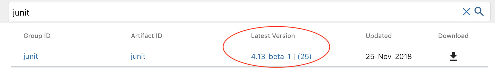
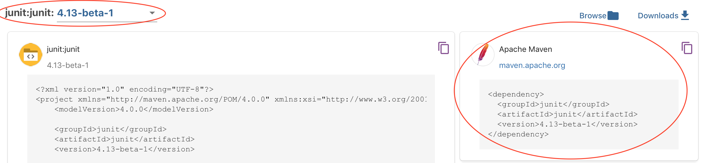

= Introdução ao Test Driven Development (TDD): Desenvolvimento Guiado por Testes

Esta pasta fornece um projeto de exemplo de aplicação de TDD como processo
de desenvolvimento de software, utilizando neste caso o paradigma de 
Programação Orientada a Objetos (POO).

O projeto introduz TDD pelo teste de funções básicas como cálculo do MDC e verificação de números primos.
Os passos para a implementação de um algoritmo para cálculo do MDC foram baseados 
nas https://pt.wikipedia.org/wiki/Máximo_divisor_comum#Propriedades[propriedades do MDC indicadas na Wikipedia].

== Detalhes do Projeto

Este não é um projeto Java comum, mas um projeto do tipo Maven [https://pt.wikipedia.org/wiki/Apache_Maven[1], http://maven.apache.org[2]].
O Maven é um gerenciador de dependências e automatização de compilação (_build_) do projeto. 
Ele permite automatizar o download de bibliotecas externas que nosso projeto utiliza.
Desta forma, não precisamos nos preocupar em encontrar o site da biblioteca,
procurar a página de download, fazer o download de um pacote jar e adicionar ao projeto.

Este arquivo `pom.xml` é criado automaticamente quando você cria um projeto Maven.
Quando precisar criar um projeto deste tipo, você deve utilizar a opção de criar novo projeto no IDE que você estiver utilizando.
Lá você deve procurar por "Maven" para criar o projeto deste tipo.

O projeto disponibilizado aqui utiliza o framework http://junit.org[JUnit] para construção e automação de execução de testes unitários. Como o JUnit é uma dependência externa (que não vem disponível com o JDK), 
é extremamente mais fácil criar um projeto Maven, indicar que ele depende do JUnit
e deixar o Maven fazer o download de tal dependência.

Tudo isso é feito pelo Maven a partir do momento que você indica
na tag `<dependencies>` (que se não existir deve ser criada em qualquer lugar
na raiz da tag `<project>` (como por exemplo, antes de `</project>`), dentro do arquivo link:pom.xml[pom.xml],
quais são as dependências (tags `<dependency>`) que seu projeto precisa.
No caso do JUnit, tal tag dentro de `<dependencies>` será, por exemplo:

[source,xml]
----    
<dependency>
    <groupId>junit</groupId>
    <artifactId>junit</artifactId>
    <version>4.12</version>
    <scope>test</scope>
</dependency>
----

A maioria das dependências disponíveis através do Maven podem ser consultadas em http://search.maven.org.
Se você buscar por `junit`, encontrará tal dependência normalmente no topo da lista, como mostra a imagem abaixo.

.Buscando uma dependência como o JUnit no http://search.maven.org[Maven Central].

{nbsp} +

Clicando no número da versão na 3ª coluna, podemos obter o trecho XML exibido acima para incluir no nosso arquivo link:pom.xml[]. Este é exibido no canto superior direito.
Observe que é exibida a última versão da dependência selecionada. Se você quiser uma versão diferente, pode escolher no canto superior esquerdo e depois copiar o trecho XML no canto superior direito. A imagem abaixo apresenta estes detalhes.

.Copiando o trecho XML para incluir a dependência no arquivo link:pom.xml[pom.xml] do projeto Maven.

{nbsp} +

Observe que, apesar de existir um botão de download nas páginas apresentadas, criando um projeto Maven, não precisamos baixar manualmente qualquer dependência. As dependências baixadas ficam salvas na pasta `.m2/repository` dentro da pasta do 
seu usuário no computador que estiver usando. Assim, a pasta do seu projeto não fica cheia de arquivos que podem
ser baixados da Internet. Adicionalmente, se vários projetos usam uma mesma versão de uma dependência, ela é baixada apenas uma vez. Por fim, se você mudar de máquina, não precisa se preocupar com as dependências. Ao compilar (build) o projeto, elas serão baixadas se necessário.

== Estrutura do Projeto

Um projeto Maven em Java tem a seguinte estrutura de pastas:

- link:src/main/java[src/main/java]: pasta onde você deve incluir o código fonte do seu projeto, ou seja, classes e interfaces. Este é o código principal do projeto.
- link:src/test/java[src/test/java]: pasta onde você deve incluir os testes para o seu projeto. Nesta pasta você incluirá então classes de testes, ou seja, classes contendo métodos para testar o código o código do projeto. 
- target: pasta que será criada quando você compilar o projeto e que pode ser apagada a qualquer momento.

Assim, podemos ter o código principal do projeto na pasta `src/main/java` e o código de testes em `src/test/java`.
Cada classe de teste deve ser referente a uma classe principal. 
Se a classe principal tiver muitos métodos ou a quantidade de testes para cada um
destes métodos for muito grande, podemos criar uma classe de teste contendo 
apenas testes para um determinado método da classe sendo testada.

Assim, para a classe principal como link:src/main/java/com/manoelcampos/tdd/com.manoelcampos.noite.MathUtil.java[com.manoelcampos.noite.MathUtil.java],
poderíamos ter a classe de teste `MathUtilTest.java`.
No entanto, como só os testes do método `mdc` já são muitos,
foi criada uma classe de teste link:src/test/java/com/manoelcampos/tdd/MathUtilMdcTest.java[MathUtilMdcTest.java]
apenas com os testes deste método.
Esta classe utiliza o JUnit para a construção e automatização da execução dos testes.
