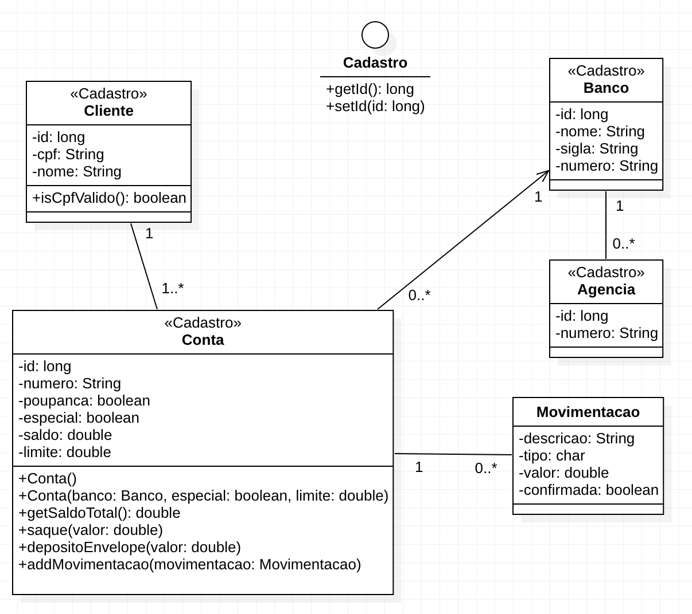

= Projeto de Sistema Bancário para Inclusão de Testes Unitários

Este projeto fornece um conjunto de classes base para que sejam implementados testes unitários.

As classes do sistema são apresentadas no diagrama UML abaixo.
O diagrama pode ser editado no arquivo link:sistema-bancario.staruml.mdj[sistema-bancario.staruml.mdj],
que é um projeto do http://staruml.io[StarUML].
No projeto podem ser observados diversos detalhes e documentação das classes apresentadas abaixo.

.Diagrama das Classes de Negócio do Sistema Bancário (pacote link:src/main/java/com/sistemabancario/model[model]).

{nbsp} + 

Perceba que a interface `Cadastro` é implementada por todas as classes exibidas acima, mas o relacionamento não foi exibido para evitar um emaranhado de linhas. De qualquer forma, pode observar que as classes são estereotipadas (rotuladas) com `\<<Cadastro>>`.

O código de tais classes foi gerado a partir do StarUML e está disponível em um link:src[projeto Java
na pasta src], contendo a mesma documentação disponível no projeto UML.
A documentação JavaDoc incluída no código fonte das classes informa como os métodos devem funcionar,
quais as regras de validação de atributos e outros detalhes.
A partir destas definições apresentadas, pode-se então escrever os testes e o código dos métodos gerais, getters e setters das classes. Observe que estes dois últimos tipos de métodos não são mostrados no diagrama por simplificação.

O projeto Java possui os seguintes pacotes:

- link:src/main/java/com/sistemabancario/dao[dao]: ver definição no arquivo link:src/main/java/com/sistemabancario/dao/package-info.java[package-info.java].
- link:src/main/java/com/sistemabancario/model[model]: ver definição no arquivo link:src/main/java/com/sistemabancario/model/package-info.java[package-info.java].